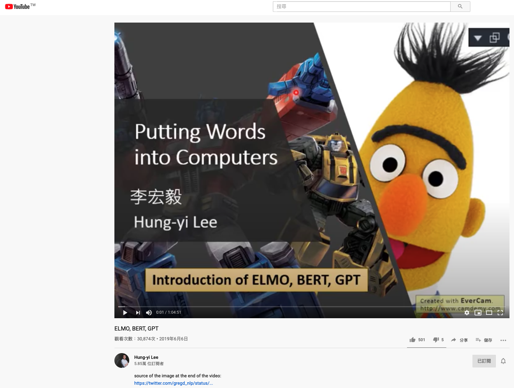
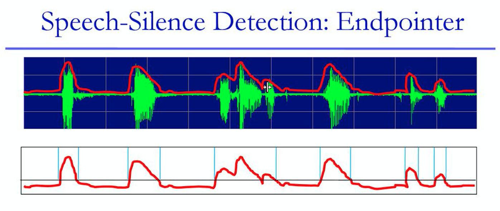

# Speech2TextSummary

想像你距離繳交500字課程心得的死線剩下一小時，但線上課程影片卻還有三個小時之久…；又或著慣老闆給你一個三小時的會議錄音檔，要你在一小時內做出重點摘要…，你是選擇放棄、死亡、或著我就爛？

沒事，自從我學會Python後，心得都一百分，老闆都很滿意，因為我花一個晚上簡單整理了線上免費開源資源，以後心得都可以無(人)腦生成了。

*效果還有待加強就是了…*

```
生成流程：
1. Set input file format as .wav | 確認語音檔格式(個人是使用.wav檔)
2. Speech to Text | 將語音檔轉換為文字檔(逐字稿)
3. Text Summarization | 將文字檔轉換成重點摘要
```

## 1. Preprocessing - Set Input File format as .wav
- 選好要轉換的Youtube課程/教學影片/會議錄音

<center>e.g. 台大李宏毅老師的BERT課程</center>

- 將檔案下載並轉換為.wav檔 (https://www.savethevideo.com/convert)


## 2. Speech to Text
### 1st Method:
*此處參考：[geeksforgeeks](https://www.geeksforgeeks.org/python-speech-recognition-on-large-audio-files/)*

#### (1) Audio Chunk Segmentation 聲音段落切割：
- Silence Detection 沈默段落(斷點)偵測：

``` =
使用套件：pydub

主要參數：
    min_silence_len(ms)：最短沈默時間(沈默超過此時間才算是[沈默段落])
        預設為1000，實測1200效果較好
    silence_thresh(dBFS)：沈默閾值(音量小於次數字才會當作是沈默)
        預設為-16，實測-42效果較好(跟聲音檔音量有關)
    chunk_silent(ms)：每個[聲音段落]前後的添加的沈默時間
        e.g. 聲音段落A => 聲音段落A'(1秒沈默+聲音段落A+1秒沈默)
        預設為10
    chunk_expand(ms)：每個[聲音段落]延伸的時間
        e.g. 聲音段落A(05:00-07:00) => 聲音段落A'(04:55-07:05)
```


<center>上圖黑色橫線即為silence_thresh; 藍色縱線分割出[沈默區間]和[聲音區間]</center>

#### (2) Audio Chunk to Text Sentence [聲音段落]轉換為[文字句子]：
- 透過Google中文語音辨識API將語音轉為文字
```=
使用套件：speech_recognition
rec = r.recognize_google(audio_listened, language = 'zh-tw')
```
### 2nd Method:
另外，我也有試過由台灣AI Lab開發的[雅婷逐字稿](https://asr.yating.tw)(聲音轉文字服務)，不過個人嘗試後覺得效果沒有很好。


## 3. Text Summarization - TextRank
*此處參考：[TextRank4ZH](https://github.com/letiantian/TextRank4ZH)*

### 文本摘要(Text Summarization)大致可以分為兩類：
- **提取式摘要(Extraction-based summarization)**：這些方法是從一段文本中提取幾個部分，例如短語和句子，並計算出它們不同的權重，並按照重要性將它們堆疊在一起以生成摘要。
- **抽象式摘要(Abstraction-based summarization)**：這些方法使用進階的 NLP(自然語言)技術生成全新的摘要。這些摘要的某些部分甚至可能沒有在原始文本中出現。

#### 此處我們使用提取式摘要的其中一個演算法：TextRank

<center>TextRank (Sim: Sentence Similarity; Sent: Sentence)</center>

- 將每個句子視為一個節點
- 將句子與句子之間的相似度視為無向邊的權重
- 由PageRank公式計算出各個句子的重要性

- 收錄重要性最高的n個句子


**[李宏毅老師的BERT youtube課程] Output Result**：
``` 
摘要：
Sent Idx: 32, Weight: 0.0400
徐來說在完全沒有訓練資料的情況下就自動做到reading comprehension session跟transition人任務需要有一些訓練資料我像我們剛才在講的時候我們也可以做一定需要給資料完全沒有q有關的訓練色情況下就嘗試去應做什麼呢你直接給cpt2一篇文章再給他一個問題接下來你輸入冒號他就會自己突出答案也是給q文章一下來你輸入一個二書的符號你輸入的ldr動力的縮寫一下來就前面這篇文章的.
Sent Idx: 15, Weight: 0.0320
他有兩個訓練的方法只有15個特殊的事情就是到底應該是哪一個linear的非常好的為何會有類似的如果你說了就知道誰沒穿褲子沒了就知道誰沒穿褲子破了為何感的話他們就會有比較類似的類似的.
Sent Idx: 26, Weight: 0.0319
有問題是有人會不會說假設現在矛盾怎麼辦如果現在出第二個答案就是沒有就是沒有答案的你要回答是對的答案而是.
Sent Idx: 34, Weight: 0.0314
今天天氣怎麼樣呢那怎麼樣呢我覺得這個可以搭乘的結果凍手術代表這個正確率高CPU使用的參數最大的那個1500個最大的那他們可以相提並論忘了取PPT從來沒有人叫他任何跟裡面的文章所訓練出來的問題的答案.
Sent Idx: 33, Weight: 0.0309
有一個讓我覺得所思的是他居然還可以做翻譯你就輸入給他很多英文的句子然後跟他說你說給他一個英文的句子然後再給他一個等號後面接法文的句子另外一個英文的句子再給他一個帳號後面的句子寫下來他就會輸出那個英文句子翻譯.
```

---

## 小結：
### Speech to Text的效果並不好
- 逐字稿生成對於參數的敏感度相當高，因此需要比較多的力氣選取較適合該音檔的參數。
- Google提供的免費語音辨識服務功能有限，無法針對Speech的主題調整Language Model等等，其他進階的語音辨識服務(包括Amazon, IBM, 百度…)都需付費，未來有大量需求的話可以考慮。

### 未來嘗試方向
- 針對語音辨識的部分，自己做模型，才能按照需求去做加強。(當初不好好修琳山大師的DSP…)
- 針對文本摘要的部分，嘗試[抽象式摘要]模型。